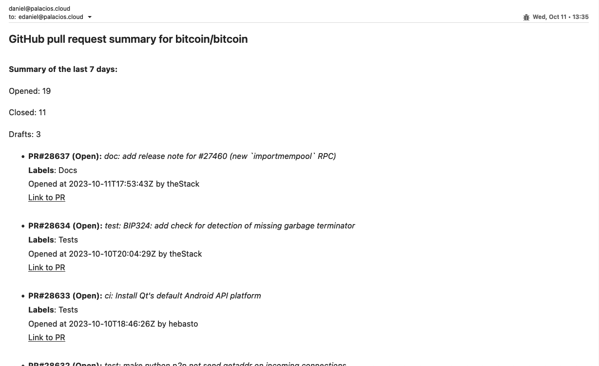

# GitHub Pull Requests Summary Script

This script fetches a summary of open, closed, and draft pull requests from the past week for a specified GitHub repository. It then emails this summary using Amazon SES.

### Prerequisites

- Python 3+
- An AWS account with Amazon SES enabled
- A verified sender email address in Amazon SES
- Generated AWS credentials (Access Key ID and Secret Access Key)
- If your Amazon SES account is in the sandbox, you also need to [verify the recipient email address](https://docs.aws.amazon.com/ses/latest/DeveloperGuide/verify-email-addresses.html)

AWS credentials can be generated through the AWS Management Console. Detailed instructions can be found in the [AWS User Guide](https://docs.aws.amazon.com/general/latest/gr/aws-sec-cred-types.html#access-keys-and-secret-access-keys).

### Installation

1. Clone the repository:

   ```shell
   git clone https://github.com/danpaldev/pr-assignment.git
   ```

2. Create a virtual environment and activate it:

   **On macOS and Linux:**

   ```shell
   python3 -m venv env
   source env/bin/activate
   ```

   **On Windows:**

   ```shell
   py -m venv env
   .\env\Scripts\activate
   ```

3. Install the required packages:

   ```shell
   pip install -r requirements.txt
   ```

4. Create a `.env` file in the root directory of the project, and add the following variables with the actual username of the repository owner and the repository name:

   ```shell
      REPO_OWNER=                  //GitHub repository owner
      REPO_NAME=                   //GitHub repository name
      FROM_EMAIL=                  //Your verified AWS SES sender email
      TO_EMAIL=                    //Recipient email
      AWS_ACCESS_KEY_ID=           //Your AWS access key id
      AWS_SECRET_ACCESS_KEY=       //Your AWS secret access key
      AWS_REGION=                  //Your AWS region
   ```

## Usage

After performing the installation steps, you can run the script:

```shell
python pr_script.py
```

The program fetches a list of pull requests from the specified GitHub repository, assembles a summary, and sends the summary in an email using AWS SES.

## Example

As an example, I tracked the Pull Requests of the bitcoin project repository. The email would look like this:

